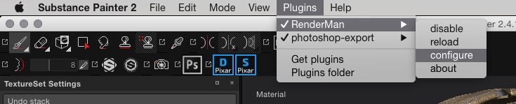
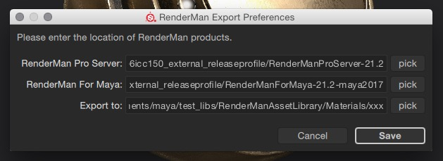
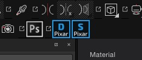

# RfSP

## RenderMan for Substance Painter 24.1

This plugin exports your [Substance Painter](https://www.allegorithmic.com/products/substance-painter) project as one or more RenderManAsset.

RenderManAsset is the format used by the preset browser that was introduced in [RenderMan For Maya](https://rmanwiki.pixar.com/display/REN/RenderMan+for+Maya) 21.0. It allows for easy material setup interchange and includes dependencies like textures or OSL shaders.

[Full demo video of 0.1.1](https://youtu.be/ZEyT95aPFYk)

## Features

###  : Export to PxrDisney-based material

The asset will use the PxrDisney bxdf to re-create the Substance Painter material. There are limitations though:

* The Substance Painter project MUST use the pbr-metal-rough shader.
* normals MUST be in directx format.
* Opacity is not supported.

###  : Export to PxrSurface-based material

* The Substance Painter project MUST use the pbr-metal-rough shader.
* normals MUST be in directx format.
* Opacity is not supported.

## Requirements

This plugin will NOT work without the following software:

* Substance Painter 2.3+
* RenderMan Pro Server 21.0+
* RenderMan For Maya 21.0+
* [Python 2.7+](https://www.python.org/downloads/release/python-2712/) (but not Python 3.x)

## Install

* Download a zip archive from the github page
* Un-zip the archive
* Copy the RenderMan folder inside Substance Painter's plugin folder.
  > OSX: `/Users/yourlogin/Documents/Substance Painter 2/plugins`

## Known Issues

* No progress indication during export: be patient !
  * It takes time to export the maps and turn them into textures. The plugin will print a message in the log when done.

## Usage

1. On first use, open the "configure" dialog.

   

1. Fill ALL fields of the dialog and click "Save", otherwise the export will fail.

   

1. Once this initial configuration is done, the settings will be remembered even if you close Substance Painter.

1. Open a SP project and click one of the pixar buttons in the shelf.

   Hint: _Only the first one (PxrDisney) works for now._

   

## Release notes

### 0.3.0

* **new**
  * UDIM support
  * The export code converts SP images to RenderMan textures

* **code**
  * Refactored javascript json export.

### 0.2.2

* new
  * Added metadata to the asset files: user, description, resolution.
  * Compatibility chunk holds Substance Painter version.

* Fixed
  * better match with PxrSurface. Updated rules.json to fix a number of issues:
    * roughness should not be linearized
    * metallicity should not be linearized
    * normal map should use directx orientation
  * exported normal map contains mesh normals + bump + normal map.

* code
  * Added a new "settings" section to rules.json to set node param values in the shading graph.
  * Some refactoring

### 0.2.1

* Fixed
  * Fix ui error in Substance Painter 2018 (was ok in SP 2.x)

### 0.2.0

* New
  * Added support for RenderMan 22.x.
    * REMEMBER to change the SP prefs to point to RenderMan 22.x
  * The assets are now named after the SP project's name.
* Fixed
  * The specular was incorrect when outputing for PxrSurface.
  * The correct renderman version number is saved in the asset file.
* code
  * Refactored file path management.
  * Used logging module instead of my own.
  * Doc strings and PEP-8 fixes

### 0.1.4

* Initial support for PxrSurface
  * Simply use the rough metal workflow in Substance Painter and it will be converted to work with PxrSurface.
  * Also fixed Issue #2, reported by dayelov. Thanks !

### 0.1.2

* windows file paths were not correctly serialized to json.
* mention python dependency in README
* Final cleanup was inadvertantly disabled
* Fixed incorrect path on windows.

### 0.1.1

* Added license text to all source files.

### 0.1.0

* Initial Release
* Implemented configure dialog to specify the path to RenderMan Pro Server and RenderMan For Maya. This is necessary because SP uses javascript, a sandboxed language that can not get access to environment variables.
* Export all channels from all textureSets to png files.
* Implemented basic export to PxrDisney-based asset.
  * Each TextureSet will be exported as a RenderManAsset directory.
